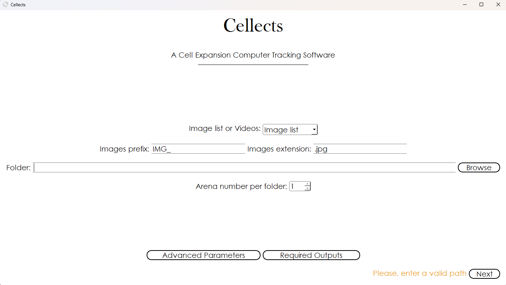

Cellects: Cell Expansion Computer Tracking Software
===================================================

Description
-----------

Cellects is a tracking software for organisms whose shape and size change over time. 
Cellects’ main strengths are its broad scope of action, automated computation of a variety of geometrical descriptors, 
easy installation and user-friendly interface.

<figure>
  
  <figcaption><strong>Figure 1:</strong> Cellects first window</figcaption>
</figure>

---

## 🚀 Installation (Short version)
Install using our Windows installer: [Cellects_installer.exe](https://drive.google.com/file/d/1v2ppaln0LJ5QhXXq1D-zduhfun5D2ZXX/view?usp=drive_link)

Or, install via pip:
```bash
pip install cellects
```
Any difficulties? follow our [complete installation tutorial](https://github.com/Aurele-B/Cellects/blob/main/doc/installation.md)

---

## 🎯 Quick Start
Run in terminal:
```bash
Cellects
```

---

## 📚 Documentation

Full documentation is available in the [docs](https://github.com/Aurele-B/cellects/blob/main/doc/) folder and includes:
- [**User Manual**](https://github.com/Aurele-B/cellects/blob/main/doc/first-analysis/index.md): Step-by-step workflows for data localization, image analysis and video tracking 
- [**Advanced Features**](https://github.com/Aurele-B/cellects/blob/main/doc/advanced/index.md): Customization options, batch processing, parameter tuning.
- [**API Reference**](https://github.com/Aurele-B/cellects/blob/main/doc/contributing.md): Auto-generated from source code docstrings (see [Build Documentation]).

---

## 🧪 Use Cases

See [use cases](https://github.com/Aurele-B/cellects/blob/main/doc/use-cases.md) for real-world examples:
- Automated Physarum polycephalum tracking using GUI
- Automated Physarum polycephalum tracking using API
- Colony growth tracking

---

## 🛠 Contributing

We welcome contributions!  
1. Fork the repository and create a new branch.
2. Submit issues/PRs via [GitHub](https://github.com/Aurele-B/cellects/issues).

For developer workflows, see [**Contributing**](https://github.com/Aurele-B/cellects/blob/main/doc/contributing.md).

---

## 📌 License & Citation

GNU GPL3 License (see [LICENSE](https://github.com/Aurele-B/cellects/blob/main/LICENSE.odt)).

To cite Cellects, use:
```bibtex
@article{boussard2024cellects,
  title={Cellects, a software to quantify cell expansion and motion},
  author={Boussard, Aur{\`e}le and Arrufat, Patrick and Dussutour, Audrey and P{\'e}rez-Escudero, Alfonso},
  journal={bioRxiv},
  pages={2024--03},
  year={2024},
  publisher={Cold Spring Harbor Laboratory}
}
```

---

## 🧪 Testing

Run unit tests with:
```bash
pytest
```

---

## Resources
- [Usage example (video)](https://www.youtube.com/watch?v=N-k4p_aSPC0)
