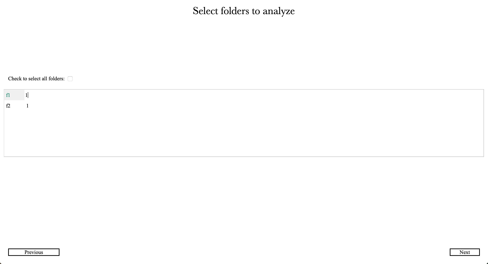

# Analyze multiple folders at once

Analyzing multiple folders at once (Fig. 11) streamlines high-throughput experimentation by applying validated analysis parameters to entire datasets with minimal user intervention. 
By configuring folder selection and per-folder arena counts, users ensure that Cellects applies the same detection logic uniformly while respecting experimental heterogeneity.

# Detailed description

<figure>
  
  <figcaption><strong>Figure 11:</strong> Select folders to analyze window</figcaption>
</figure>

---

The window of **Figure 11** appears after the first window when the selected folder contains subfolders with images matching the *Image prefix* and *Images extension* patterns.  

---

<!-- START_Check_to_select_all_folders -->
## Check to select all folders:
Select this option to run the analysis on all folders containing images matching the *Image prefix*
and *Images extension*. Otherwise, use Ctrl/Cmd to select specific folders for analysis.
!!! note

	 - This setting affects only the *Run All* functionality.
	 - To apply saved masks (e.g., background or specimen initiation regions) across selected folders,enable    *Keep Cell and Back drawing for all folders* in *Advanced parameters*.
<!-- END_Check_to_select_all_folders -->

---

Here, the user can adjust the number of arenas for each folder  

Click **Next** to go to the image analysis window (Fig. 2) of the first selected folder.  

---

## Notes

- If the *Select and draw* option is required for more than one folder, analyze them separately.  
  → In that case, click *Previous* and select only one subfolder.  

- If only one folder requires the *Select and draw* option, analyze it first.  
  → To do so, deselect all folders, select the one that needs drawing, then hold `Ctrl/Cmd` while selecting the others.  

- If the first selected folder has already been analyzed, two shortcuts appear:  
  - **Video tracking window** → skips the image analysis window, lets the user tune video tracking before running all  
  - **Run all directly** → skips both image analysis and video tracking, applies saved settings to all folders directly  