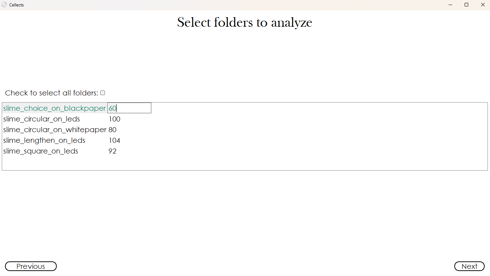

# Required outputs
The Required outputs window (Fig. 11) defines what quantitative descriptors Cellects computes and exports during analysis—a critical step in ensuring reproducible, shareable results aligned with open science standards. 
Users select from a range of spatial and temporal metrics (e.g., area, perimeter, oscillation patterns) as well as pixel coordinates, geometrical graphs (vertices.csv, edges.csv), or network skeletons. 
These outputs bridge raw imaging data to downstream analysis in statistical tools, modeling software, or collaborative platforms. 

For example:
- Pixel-level tracking (e.g., [Pixels covered by the specimen(s)]) enables high-resolution morphodynamics studies.
- Graph/network outputs (e.g., [Graph of the specimen(s)]) are essential for organisms with internal branching structures (Physarum polycephalum), capturing topological changes over time.

# Detailed description

<figure>
  
  <figcaption><strong>Figure 10:</strong> Required output window</figcaption>
</figure>

---

<!-- START_coord_specimen -->
**[Pixels covered by the specimen(s)]**:
Save a .npy file containing coordinates (t, y, x) of specimen pixel presence as detected by current
parameters.
NB:
- These files may consume significant memory depending on the total frame count.

<!-- END_coord_specimen -->

---

<!-- START_Graph -->
**[Graph of the specimen(s) (or network)]**:
Compute a geometrical graph describing the specimen based on current detection parameters.  Cellects
generates this graph using the skeleton of the largest connected component per frame.  If network
detection is enabled, it will be computed on the detected network instead. The output includes:
- A .csv file for vertices with coordinates (t, y, x), IDs, tip status, part of the specimen's
initial position, connection status with other vertices.
- A .csv file for edges with IDs, vertex pairs, lengths, average width, and intensity.
NB:
- These files may consume significant memory depending on the total frame count.
- Network and graph detection together are relevant only for organisms with a distinct internal
network (e.g., *Physarum polycephalum*).

<!-- END_Graph -->

---

<!-- START_coord_oscillating -->
**[Oscillating areas in the specimen(s)]**:
Compute and save (as .npy files) coordinates (t, y, x) of oscillating areas in the specimen(s).  Two
files are generated: one for thickening regions and one for slimming regions.

<!-- END_coord_oscillating -->

---

<!-- START_coord_network -->
**[Network in the specimen(s)]**:
Detect and save (as .npy file) coordinates (t, y, x) of a distinct network within the specimen(s).
specimen(s).

<!-- END_coord_network -->

---

## Save descriptors
Saves selected descriptors in `.csv` files at the end of the analysis (*Run all*).  

Available descriptors include:  
- Area  
- Perimeter  
- Circularity  
- Rectangularity  
- Total hole area  
- Solidity  
- Convexity  
- Eccentricity  
- Euler number  
- Standard deviation (x, y)  
- Skewness (x, y)  
- Kurtosis (x, y)  
- Major axes lengths and angles  
- Growth transitions
- Oscillations
- Minkowski dimension
