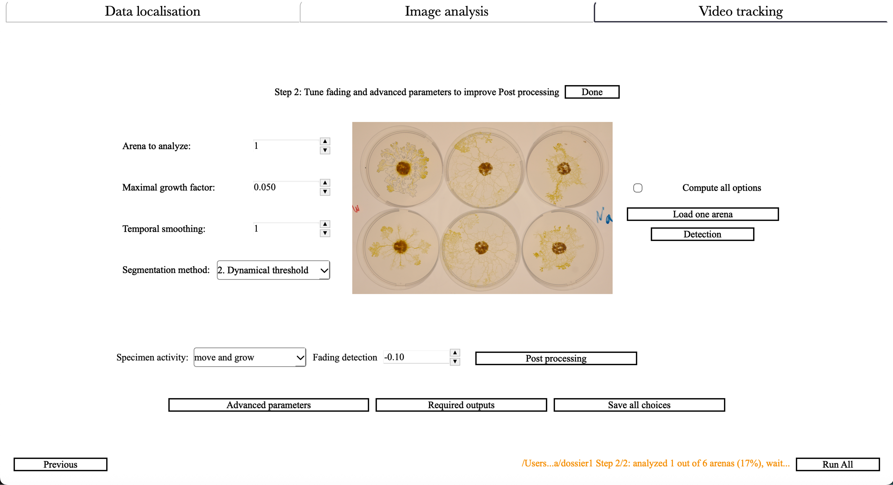

# Advanced parameters

<figure>
  
  <figcaption><strong>Figure 8:</strong> Advanced parameters window</figcaption>
</figure>

---

<!-- START_Crop_images -->
**[Automatically crop images]**:
Uses initial image detection to crop all images and improve arena/last image detection.
NB:
- Unselect this option if analysis fails or crashes during image analysis.

<!-- END_Crop_images -->

---

<!-- START_Subtract_background -->
**[Subtract background]**:
Takes the first image and subtracts it from subsequent images. This can improve or degrade detection
depending on dataset characteristics.

<!-- END_Subtract_background -->

---

<!-- START_Keep_drawings -->
**[Keep Cell and Back drawings for all folders]**:
During initial image analysis, if the user drew cell/back regions to assist detection, this option
saves and uses these annotations across all folders. In summary:
- **Checked** → retain annotations for all folders
- **Unchecked** → apply only to current folder

<!-- END_Keep_drawings -->

---

<!-- START_Correct_errors_around_initial -->
**[Correct errors around initial specimen's position]**:
Applies an algorithm to correct detection errors near the initial specimen position due to color
variations (e.g., from nutrient patches). Technical workflow:
- Identifies potential gaps around initial position
- Monitors local growth velocity
- Fills gaps using growth patterns from adjacent pixels
NB:
- ⚠️ Not recommended if the substrate has the same transparency everywhere (i.e. no difference
between starting and growth regions).

<!-- END_Correct_errors_around_initial -->

---

<!-- START_Prevent_fast_growth_near_periphery -->
**[Prevent fast growth near periphery]**:
During video analysis, prevents false specimen detection at arena borders by filtering rapid
periphery growth.
- **Checked** → Exclude fast
-moving detections near boundaries
- **Unchecked** → Use standard detection criteria

<!-- END_Prevent_fast_growth_near_periphery -->

---

<!-- START_Connect_distant_shapes -->
**[Connect distant shapes]**:
Algorithm for connecting disjoint specimen regions in cases where there should be only one connected
specimen per arena.  This is useful when the specimen's heterogeneity create wrong disconnections
and the detection is smaller than the true specimen. Technical implementation:
- Identifies disconnected subregions
- Analyzes local growth dynamics
- Recreates connections using spatially consistent growth patterns
NB:
- Increases analysis time substantially.

<!-- END_Connect_distant_shapes -->

---

<!-- START_Specimens_have_same_direction -->
**[All specimens have the same direction]**:
Select to optimize arena detection for specimens moving move in the same direction.
- **Checked** → Uses motion pattern analysis for arena localization.
- **Unchecked** → Employs standard centroid
-based algorithm.

<!-- END_Specimens_have_same_direction -->

---

<!-- START_Appearance_size_threshold -->
**[Appearance size threshold (automatic if checked)]**:
Minimum pixel count threshold for identifying specimen emergence (e.g., bacterial colony formation).
- **Checked** → Automatic threshold calculation.
- **Unchecked** → Manual user
-defined threshold.

<!-- END_Appearance_size_threshold -->

---

<!-- START_Appearance_detection_method -->
**[Appearance detection method]**:
Selection criteria for initial specimen detection:
- Largest: Based on component size metric.
- Most central: Based on arena center proximity.
NB:
- Applicable only to progressively emerging specimens.

<!-- END_Appearance_detection_method -->

---

<!-- START_Mesh_side_length -->
**[Mesh side length]**:
Pixel dimension for analysis window size.
NB:
- Must not exceed minimum image dimension

<!-- END_Mesh_side_length -->

---

<!-- START_Mesh_step_length -->
**[Mesh step]**:
The size of the step (in pixels) between consecutive rolling window positions.
NB:
- Must not exceed the mesh side length to ensure full coverage of the image.

<!-- END_Mesh_step_length -->

---

<!-- START_Mesh_minimal_intensity_variation -->
**[Mesh minimal intensity variation]**:
The minimal variation in intensity to consider that a given window does contain the specimen(s).
NB:
- This threshold is an intensity value ranging from 0 to 255 (generally small).
- Correspond to the level of noise in the background.

<!-- END_Mesh_minimal_intensity_variation -->

---

<!-- START_Expected_oscillation_period -->
**[Expected oscillation period]**:
The period (in minutes) of biological oscillations to detect within the specimen(s). Computation is
based on luminosity variations.

<!-- END_Expected_oscillation_period -->

---

<!-- START_Minimal_oscillating_cluster_size -->
**[Minimal oscillating cluster size]**:
When looking for oscillatory patterns, Cellects detects connected components that are thickening or
slimming synchronously in the specimen(s). This parameter thresholds the minimal size of these
groups of connected pixels. This threshold is useful to filter out small noisy oscillations.

<!-- END_Minimal_oscillating_cluster_size -->

---

<!-- START_Spatio_temporal_scaling -->
**[Spatio-temporal scaling]**:
Defines the spatiotemporal scale of the dataset:
- Time between images or frames (minutes).
- An option to convert areas/distances from pixels to mm/mm².

<!-- END_Spatio_temporal_scaling -->

---

<!-- START_Parallel_analysis -->
**[Run analysis in parallel]**:
Allow the use of more than one core of the computer processor.
- **Checked** → Uses multiple CPU cores to analyze arenas in parallel (faster).
- **Unchecked** → Single core analysis.

<!-- END_Parallel_analysis -->

---

<!-- START_Proc_max_core_nb -->
**[Proc max core number]**:
Maximum number of logical CPU cores to use during analysis. The default value is set to the total
number of available CPU cores minus one.

<!-- END_Proc_max_core_nb -->

---

<!-- START_Minimal_RAM_let_free -->
**[Minimal RAM let free]**:
Amount of RAM that should be left available for other programs. Setting to `0` gives Cellects all
memory, but increases crash risk if other apps are open.

<!-- END_Minimal_RAM_let_free -->

---

<!-- START_Lose_accuracy_to_save_RAM -->
**[Lose accuracy to save RAM]**:
For low memory systems:
- Converts video from `np.float64` to `uint8`
- Saves RAM at the cost of a slight precision loss

<!-- END_Lose_accuracy_to_save_RAM -->

---

<!-- START_Video_fps -->
**[Video fps]**:
Frames per second of validation videos.

<!-- END_Video_fps -->

---

<!-- START_Keep_unaltered_videos -->
**[Keep unaltered videos]**:
Keeps unaltered `.npy` videos in hard drive.
- **Checked** → Rerunning the same analysis will be faster.
- **Unchecked** → These videos will be written and removed each run of the same analysis.
NB:
- Large files: it is recommended to remove them once analysis is entirely finalized.

<!-- END_Keep_unaltered_videos -->

---

<!-- START_Save_processed_videos -->
**[Save processed videos]**:
Saves lightweight processed validation videos (recommended over unaltered videos). These videos
assess analysis accuracy and can be read in standard video players.

<!-- END_Save_processed_videos -->

---

<!-- START_Csc_for_video_analysis -->
**[Color space combination for video analysis]**:
Advanced option: Changes the way RGB processing directly in video tracking. Useful for testing new
color spaces without (re)running image analysis.

<!-- END_Csc_for_video_analysis -->

---

<!-- START_Night_mode -->
**[Night mode]**:
Switches the application background between light and dark themes.

<!-- END_Night_mode -->

---

<!-- START_Reset_all_settings -->
**[Reset all settings]**:
Useful when the software freezes with no apparent reason. To reset all settings, it removes the
config file in the  current folder as well as the config file in the software folder. Then, it
retrieves and saves the default parameters.

<!-- END_Reset_all_settings -->

---