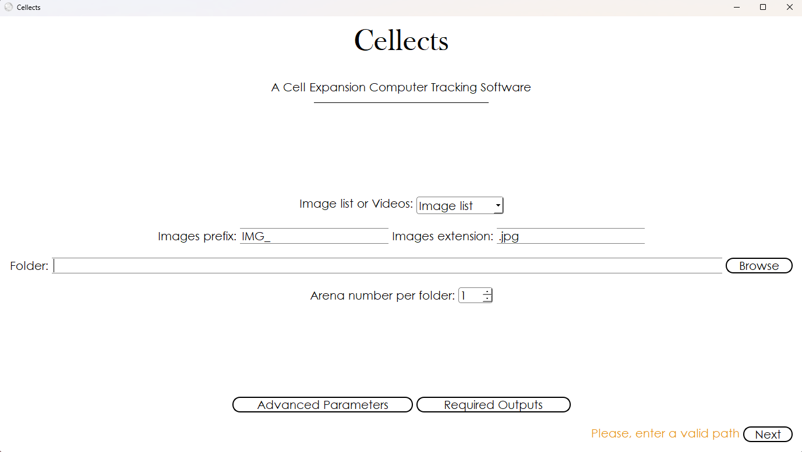

# Data localisation in the first window

Before diving into detailed analysis workflows, Cellects requires initial setup (Fig. 1) to define the scope and format of the data being processed. This first window serves as the gateway to configuring foundational parameters that underpin all subsequent steps: from basic image/video tracking to advanced video analytics. 
Users will specify whether their input consists of an image stack or a single video file, establish naming conventions for targeted files (e.g., prefixes like "exp_" and extensions like ".jpg"), and define the root folder(s) containing experimental data. Additionally, this interface allows users to declare how many independent arenas are present in each dataset—a critical step for ensuring accurate analysis. 
These configurations directly inform later stages (e.g., image analysis, video tracking) and enable automation across multiple folders if required (See Fig. 10).

# Detailed description of the window

<figure>
  
  <figcaption><strong>Figure 1:</strong> Cellects first window</figcaption>
</figure>

---

<!-- START_Image_list_or_videos -->
## Image list or videos:
The *Image list or video* option indicates whether the data have been stored as an image stack (i.e.
a set of files, each of them containing a single image) or as a video. Images must be named
alphanumerically so the program can read them in the right order.

<!-- END_Image_list_or_videos -->

---

<!-- START_Image_prefix_and_extension -->
## Image prefix and extension:
The *Images prefix* and *Images extension* fields allow Cellects to only consider relevant data. For
instance, setting 'exp_' as image prefix and '.jpg' as image extension will cause Cellects to only
consider JPG files whose name starts with 'exp_'. The rest of the labeling should be a number
indicating  the order in which the images were taken.
NB:
- Image prefix is optional
- If every .jpg files start with IMG_ but the folder(s) also contains other .jpg files (e.g. named
info.jpg),  the user can exclude all .jpg files that do not start with IMG_ by typing “IMG_” in the
*Image prefix* field.  Cellects accepts all the following formats: bmp, dib, exr, exr, hdr, jp2,
jpe, jpeg, jpg, pbm, pfm, pgm, pic, png,  pnm, ppm, ras, sr, tif, tiff, webp, cr2, cr3, nef, arw,
sr2, raf, prf, rw2, pef, dng, 3fr, iiq.

<!-- END_Image_prefix_and_extension -->
---
<!-- START_Folder -->
## Folder:
The *Folder* field must contain the computer path toward the folder(s) for Cellects to be able to
run the analysis.  The user can copy/paste this path into the field or navigate to the folder using
the *Browse* push button.  If the user wants to analyze several folders at once, the chosen path
must lead to the folder containing all folders  to analyze.

<!-- END_Folder -->

---

<!-- START_Arena_number_per_folder -->
## Arena number per folder:
The *Arena number per folder* tells how many arenas are present in the images. Then it will store
and analyze the  video for each arena separately.
NB:
- If there are several folders to analyze at once, the user can provide a different arena number for
each folder (see Fig. 10: the several folder window).

<!-- END_Arena_number_per_folder -->

---

<!-- START_Browse -->
## Browse:
Clicking the *Browse* button helps to find and open a folder to analyze.

<!-- END_Browse -->

---

<!-- START_Advanced_parameters -->
## Advanced parameters:
Clicking the *Advanced parameters* button opens the window containing all secondary parameters of
the software.  Find details about this window in the advanced documentation.

<!-- END_Advanced_parameters -->

---

<!-- START_Required_outputs -->
## Required outputs:
Clicking the *Required outputs* button opens the window allowing to choose what descriptors Cellects
will compute on the selected data. Find details about this window in the advanced documentation.

<!-- END_Required_outputs -->

---

<!-- START_Run_all_directly -->
## Run all directly:
This option appear when the user already did the image analysis for the current folder.  It is a
shortcut to skip the image analysis and to directly run and fine tune the video tracking.

<!-- END_Run_all_directly -->

---

<!-- START_Next -->
## Next:
Click the *Next* button to go to the image analysis window (Fig. 2), or  to the window showing the
list of folders (Fig. 10) if applicable.

<!-- END_Next -->

---