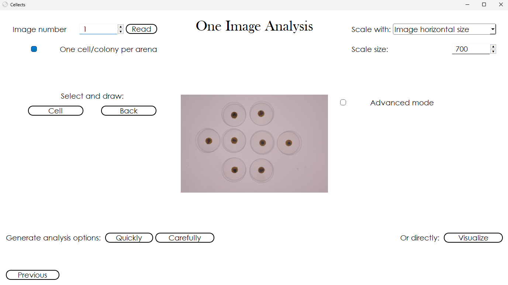
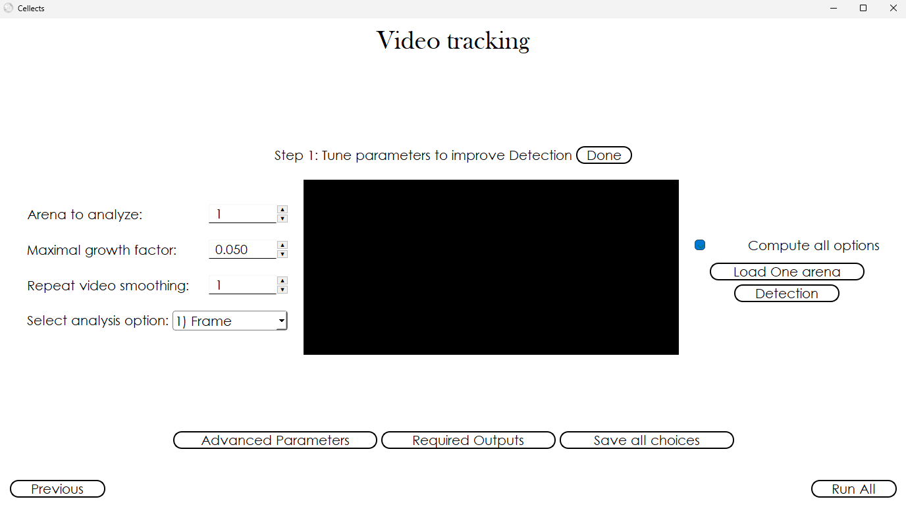

# Finding where the specimens are in the image analysis window

After defining the data source (see [Data localisation](data-localisation.md)), the next step consists in setting up Cellects to detect the specimen on single images.
This interface allows users to guide automated segmentation by specifying whether specimens are isolated per arena, selecting reference images for analysis, and defining spatial scaling parameters (e.g., converting pixel measurements to real-world units). 
Interactive tools like Select and draw enable manual correction of segmentation errors, while the Advanced mode caters to power users seeking fine-grained control over color spaces, filters, and algorithms. 
By iteratively testing segmentation methods and validating results through visual feedback (Figures 2–4), researchers calibrate Cellects to reliably distinguish specimens from background noise across heterogeneous datasets. 
Proper configuration here directly informs downstream video tracking workflows (see [Video tracking](video-tracking.md)), ensuring reproducible, high-fidelity analysis of dynamic processes such as cell migration or colony growth.

# Detailed description

<figure>
  
  <figcaption><strong>Figure 2:</strong> Cellects image analysis window</figcaption>
</figure>

---

<!-- START_Image_number -->
## Image number:
Selects the image number to analyze. This number should only be changed when specimen(s) are
invisible on the first image (e.g., in the case of appearing colonies of bacteria), never otherwise.
When the specimen(s) are invisible, read more advanced images until some material can be detected.
!!! note

	 - When the data is stored as images, this image number comes from alphanumerical sorting of originalimage labels.
<!-- END_Image_number -->

---

<!-- START_several_blob_per_arena -->
## One specimen per arena:
Select this option if there is only one specimen (e.g., a cell or connected colony) per arena. If
multiple specimens exist (or will be present) in an arena, unselect this option.
!!! note

	 - This option is selected by default.
<!-- END_several_blob_per_arena -->

---

<!-- START_Scale_with -->
## Scale with:
Specify how to compute true pixel size (in mm). Cellects can determine this scale using:

- Image width (horizontal dimension)
- Specimen width on first image (usable when specimens share consistent width)
!!! note

	 - Advanced parameters allow disabling scaling and outputting in pixels.
	 - Using specimen width reduces initial detection efficiency. We recommend using image width unlessspecimen dimensions are known with higher accuracy than imaging equipment.
	 - Pixel size is stored in a file named `software_settings.csv`.
<!-- END_Scale_with -->

---

<!-- START_Scale_size -->
## Scale size:
The *Scale size* is the actual length (in mm) corresponding to scaling reference.
!!! note

	 - This value enables conversion from pixel coordinates to physical dimensions.
<!-- END_Scale_size -->

---

<!-- START_Select_and_draw -->
## Select and draw:
*Select and draw* allows the user to inform Cellects about specimen (*Cell*) and background (*Back*)
areas in images. To use, click *Cell* or *Back* button (button color changes), then:

- Click and drag mouse on image to mark corresponding area
- Numbered drawings appear below buttons for reference
- (if needed) Click numbered drawing to remove selection.
!!! note

	 - By default, this tool only works for the first folder when analyzing multiple folders. Advancedparameters include an option to use these same masks in multiple folders.
	 - To apply saved masks (e.g., background or specimen initiation regions) across selected folders,enable *Keep Cell and Back drawing for all folders* in *Advanced parameters*.
<!-- END_Select_and_draw -->

---

<!-- START_Draw_buttons -->
## Draw buttons:
Click the *Cell* or *Back* button and draw a corresponding area on the image by clicking and holding
mouse on the image.

<!-- END_Draw_buttons -->

---

<!-- START_Generate_analysis_options -->
## Generate analysis options:
Cellects proposes algorithms to automatically determine optimal specimen detection parameters on the
first or last image:

- **Basic** → provides suggestions in minutes. Alternatively, the user can switch to *Advanced mode*
to review or modify more specific settings.
!!! note

	 - Selecting *Basic* (or *Apply current config*) will trigger an orange working message duringprocessing.
<!-- END_Generate_analysis_options -->

<figure>
  
  <figcaption><strong>Figure 3:</strong> Cellects image analysis window after analysis option generation</figcaption>
</figure>

---

<!-- START_Select_option_to_read -->
## Select option to read:
Choose the option producing optimal segmentation results. This menu appears after generating
analysis options, allowing direct quality assessment. For example, if Option 1 shows correct
detection (e.g., 6 spots in 6 arenas), click *Yes*. Otherwise, improve analysis via:

- Adjusting arena/spot shapes or sizes
- Using *Select and draw* to annotate specimens/background
- Manual configuration in advanced mode → Test changes with *Apply current config*
!!! note

	 - Confirm when magenta/pink contours match expected positions and counts.
<!-- END_Select_option_to_read -->

---

<!-- START_Arena_shape -->
## Arena shape:
Specifies whether the specimen(s) can move in a circular or rectangular arena.

<!-- END_Arena_shape -->

---

<!-- START_Spot_shape -->
## Set spot shape:
Defines the expected shape of specimens within arenas.

<!-- END_Spot_shape -->

---

<!-- START_Spot_size -->
## Set spot size:
Initial horizontal size of the specimen(s) (in mm). If similar across all specimens, this can also
be used as a scale.

<!-- END_Spot_size -->

---

<!-- START_Advanced_mode -->
## Advanced mode:
The *Advanced mode* enables fine tuning of image analysis parameters for:

- Custom color space combinations (e.g., HSV, HLS)
- Applying filters before segmentation
- Combining segmentations using logical operators
- Accessing rolling window and Kmeans algorithms
!!! note

	 - Useful for reusing validated parameter sets or testing alternative methods.
<!-- END_Advanced_mode -->

---
<figure>
  
  <figcaption><strong>Figure 4:</strong> Image analysis advanced mode</figcaption>
</figure>
---

<!-- START_Color_combination -->
## Color combination:
Color spaces are transformations of the original BGR (Blue Green Red) image Instead of defining an
image by 3 colors,  they transform it into 3 different visual properties

- hsv: hue (color), saturation, value (lightness)
- hls: hue (color), lightness, saturation
- lab: Lightness, Red/Green, Blue/Yellow
- luv and yuv: l and y are Lightness, u and v are related to colors

<!-- END_Color_combination -->

---

<!-- START_Filter -->
## Filter:
Apply a filter to preprocess images before segmentation.
!!! note

	 - Filtering can improve segmentation accuracy by emphasizing relevant image features.
<!-- END_Filter -->

---

<!-- START_Logical_operator -->
## Logical operator:
The *Logical operator* defines how to combine results from distinct segmentations (e.g., merging the
segmentation resulting from a specific color space transformation and filtering with a different
one). Supported operators: AND, OR, XOR.

<!-- END_Logical_operator -->

---

<!-- START_Rolling_window_segmentation -->
## Rolling window segmentation:
Segments image regions using a rolling window approach to detect local intensity valleys. The method
applies Otsu's thresholding locally on each window.

<!-- END_Rolling_window_segmentation -->

---

<!-- START_Kmeans -->
## Kmeans:
The *Kmeans* algorithm clusters pixels into a specified number of categories (2

-5) to identify specimen regions within the image.

<!-- END_Kmeans -->

---

<!-- START_Video_delimitation -->
## Video delimitation:
After confirming initial detection, automatic video delimitation results appear in blue.  Click
*Yes* if accurate or *No* for:

- A slower, higher precision algorithm.
- Manual delineation option.

<!-- END_Video_delimitation -->

<figure>
  
  <figcaption><strong>Figure 5:</strong> Cellects image analysis window, after arena delineation</figcaption>
</figure>

---

<!-- START_Last_image_question -->
## Last image question:
If parameters might fail on later images, test them first on the final frame:

- *Yes* → validates with last image before tracking.
- *No* → proceeds directly to video analysis.

<!-- END_Last_image_question -->

---

<!-- START_Start_differs_from_arena -->
## Check if the medium at starting position differs from the rest of the arena:
Enable if the substrate differs between initial position and arena growth area (e.g., nutritive gel
vs. agar). Disable for homogeneous substrates.

<!-- END_Start_differs_from_arena -->

---

<!-- START_Save_image_analysis -->
## Save image analysis:
Complete the analysis of the current image. Clicking this button analyzes only one image. To analyze
video(s), click *Next*.
!!! note

	 - When analyzing a single specimen per arena, keeps the largest connected component.
	 - Saves all selected descriptors in .csv format for the current image and generates a validationimage to assess segmentation accuracy.
<!-- END_Save_image_analysis -->

---
