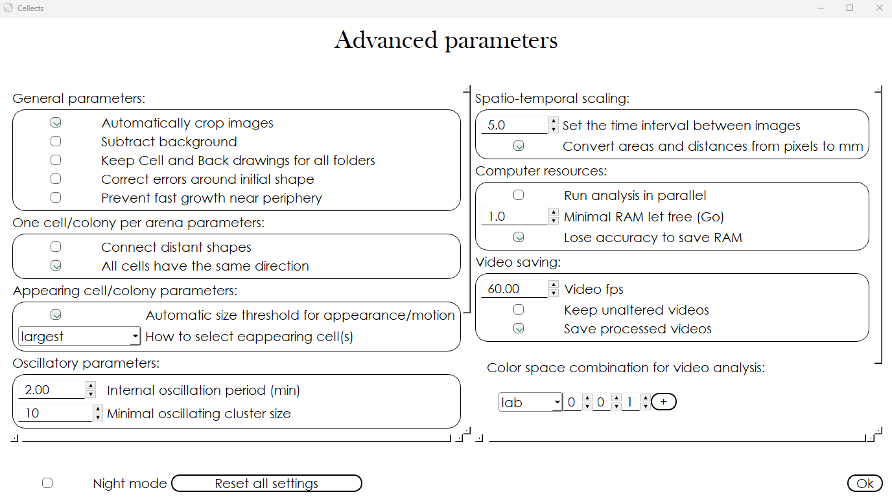

# Tuning parameters of the video tracking window

Following successful specimen detection ([Image analysis](image-analysis.md)), fine-tune the video tracking algorithms in this window. 
Here, users adjust segmentation methods (e.g., Frame, Threshold, and Slope), define spatial constraints like the maximal growth factor, and apply post-processing filters to eliminate noise and refine detection accuracy (Figures 5–7). 
By iteratively testing tracking parameters and validating results through visual feedback, researchers ensure reproducible quantification of temporal changes such as cell migration, colony expansion, or morphological shifts.

# Detailed description

<figure>
  
  <figcaption><strong>Figure 6:</strong> Cellects video tracking window</figcaption>
</figure>

---

<!-- START_Arena_to_analyze -->
## Arena to analyze:
This arena number selects a specific arena in the current folder. The user can choose an arena,
click *Detection* to load and analyze it, then *Read* results.
!!! note

	 - Cellects automatically names the arena by their position (left to right, top to bottom).
	 - For single arena setups, use 1.
	 - *Post processing* triggers *Detection*, which in turn triggers *Load One arena*.
	 - Videos can be saved (as .h5 files) for later analysis using the Advanced parameter *Keep unalteredvideos*.
<!-- END_Arena_to_analyze -->

---

<!-- START_Maximal_growth_factor -->
## Maximal growth factor:
This is the maximum allowable proportion of image area that may be covered by specimen movement
between frames. Adjust accordingly:

- Increase if specimen size is underestimated.
- Decrease if specimen size is overestimated.
!!! note

	 - Precisely, this defines an upper bound on relative coverage changes between sequential images.
<!-- END_Maximal_growth_factor -->

---

<!-- START_Temporal_smoothing -->
## Temporal smoothing:
Applies temporal smoothing to reduce noise and highlight long

-term trends by averaging pixel intensity changes. Use when analyzing slope
-based segmentation results.
!!! note

	 - This uses a moving window algorithm on pixel intensity curves over time.
	 - Excessive iterations produce constant values, preventing accurate detection.
<!-- END_Temporal_smoothing -->

---

<!-- START_Segmentation_method -->
## Segmentation method:
Cellects includes five video tracking options:

- **Frame option**: Applies the image analysis algorithm frame by frame, without temporal dynamics.
- **Threshold option**: Compares pixel intensity with the average intensity of the whole image at
each time step.
- **Slope option**: Compares pixel intensity slopes with an automatically defined threshold.
- **T and S option**: logical AND of threshold and slope options.
- **T or S option**: logical OR of threshold and slope options.
!!! note

	 - Selecting the *Compute all options* before dunning *Detection* allows method comparison.  Onceanalysis completes. Once the analysis completed, select one option and click *Read*.
	 - Computing only one option is faster and requires less memory.
	 - When *Heterogeneous background* or *Grid segmentation* has been selected in the image analysiswindow, only the *Frame* option remains available.
<!-- END_Segmentation_method -->

---

<!-- START_Load_one_arena -->
## Load one arena:
Clicking this button loads the arena associated with *Arena to analyze*. The center of the window
displays the first frame of that arena's video. Click *Read* to review the full video.

<!-- END_Load_one_arena -->

---

<!-- START_Detection -->
## Detection:
*Detection* applies a (or all) segmentation methods to one arena. Once finished, click *Read*  to
view the detection result. If correct, answer *Done* to proceed with tuning parameters for post
processing.

<!-- END_Detection -->

<!-- START_Read -->
## Read:
Clicking *Read* starts the video display corresponding to the current state of the analysis.

<!-- END_Read -->

<figure>
  
  <figcaption><strong>Figure 7:</strong> Cellects video tracking window during detection visualization</figcaption>
</figure>

---

<!-- START_Specimen_activity -->
## Specimen activity:
The behavior of the specimen(s) changes how Cellects post processes the data (after video
segmentation):

- **move** → Specimen(s) can move from one place to another in the arena but are not expected to
grow. The status of an area (specimen or background) does not depend on where the specimen(s) were
previously.
- **grow** → Specimen(s) only grow, they cannot leave an area. The previous position of the
specimen(s) is used to detect its current position.
- **move and grow** → Specimen(s) are expected to move and grow. This feature use the previous
position of the specimen(s) to evaluate growth and the pixel intensity history to evaluate when they
are left.

<!-- END_Specimen_activity -->

---

<!-- START_Fading_detection -->
## Fading detection:
*Fading detection* monitors when specimens leave previously occupied areas, useful for  moving
organisms rather than static growth. Uncheck this option if not needed. Set a value  between minus
one and one to control sensitivity:

- Near minus one: Minimal false removal of specimen traces.
- Near one: High risk of over
-removal from all areas.

<!-- END_Fading_detection -->

---

<!-- START_Post_processing -->
## Post processing:
*Post processing* applies detection algorithms with additional enhancements:

- Binary operations: opening, closing, logical ops.
- Fading detection* tracking: when specimen(s) may leave areas (optional).
- *Correct errors around initial shape*: when the contour of the initial position of the specimen is
hard to detect (optional).
- *Connect distant shapes*: when the specimen's heterogeneity create wrong disconnections in the
video detection (optional).
- *Prevent fast growth near periphery*: when arena's border (typically petri dishes) may be wrongly
detected as specimen (optional).
!!! note

	 - Once Post processing works, the user can click “*Done*” to *Step 2: Tune fading and advancedparameters to improve Post processing*, and then *Run All* arenas.
<!-- END_Post_processing -->

<!-- START_Save_one_result -->
## Save one result:
Complete the current video analysis by clicking this button for single arena processing. Saving
includes:

- Calculating all selected descriptors (.csv) per frame.
- Generating validation videos for detection verification.
- Storing configuration parameters for reproducibility.
!!! note

	 - This action will overwrite results and validation data for the current arena.
<!-- END_Save_one_result -->

<figure>
  
  <figcaption><strong>Figure 8:</strong> Cellects video tracking window, running all arenas</figcaption>
</figure>

---

<!-- START_Run_All -->
## Run All:
Apply validated parameters to all arenas by clicking *Run All*. This action:

- Generates full
-resolution video outputs (storage
-intensive)
- Processes videos sequentially with real time visualization
- Calculates selected descriptors for each frame
- Produces validation content at multiple intervals
- Preserves current configuration settings

<!-- END_Run_All -->

---

<!-- START_Save_all_choices -->
## Save all choices:
Clicking *Save all choices* writes/updates configuration files to preserve analysis parameters for
future replication.

<!-- END_Save_all_choices -->

---
